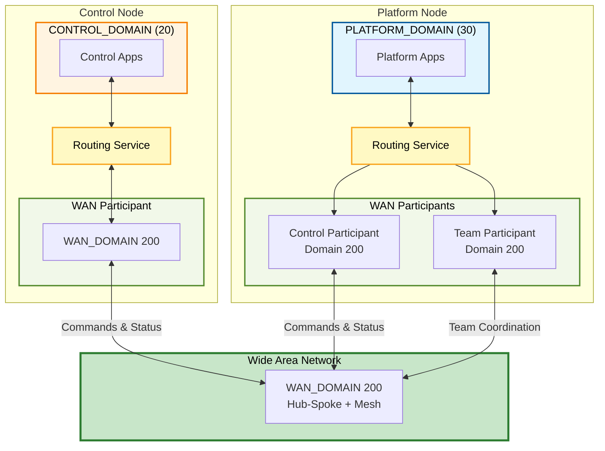

# Autonomous Collaborative Teaming (ACT) - Routing Service Architecture

RTI Routing Service architecture for Autonomous Collaborative Teaming use cases to manage message flow between Platforms (UxV's) and Control stations.

This use case is centered around a Maritime ISR scenario but can be adapted for other collaborative teaming applications.



## Getting Started

### Clone with Submodules

This repository uses git submodules for CMake utilities. Clone with:

```bash
git clone --recurse-submodules https://github.com/rticommunity/rticonnextdds-usecases-act.git
```

Or if you've already cloned without submodules:

```bash
git submodule update --init --recursive
```

## Choose Your Adventure

### Examples

- **[Quick Start](QUICKSTART.md)** - Single platform + Control communication (15 min)
- **[Multi-Platform](MULTI_PLATFORM.md)** - Two platforms with TEAM communication (20 min)
- **[Team Assignment](REMOTE_CONTROL_TEAM.md)** - Multi-tenant logical isolation (20 min)
- **[Enable Detailed Status](REMOTE_ENABLE_DETAIL_STATUS.md)** - On-demand high-bandwidth telemetry (15 min)

### Technical Details

**[TECHNICAL_DETAILS.md](TECHNICAL_DETAILS.md)** - Architecture, QoS patterns, data channels, and configuration details.

---

## Questions or Feedback?

Reach out to us at **services_community@rti.com** - we welcome your questions and feedback!