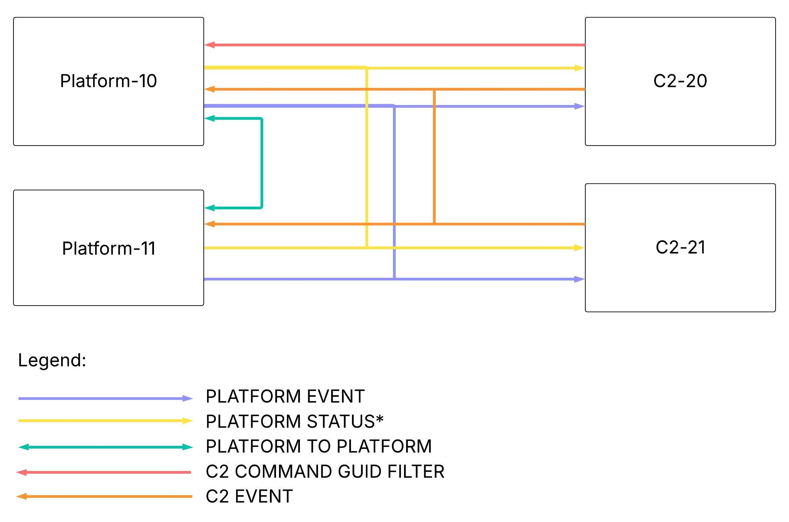

# ACT Technical Details

This document provides comprehensive technical information about the ACT (Autonomous Collaborative Teaming) architecture, including use case requirements, network design, QoS profiles, and data channels.

For quick start information, see the main [README.md](README.md).


---

## Table of Contents

1. [Repository Structure](#repository-structure)
2. [Use Case Requirements](#use-case-requirements)
3. [Features](#features)
4. [Network Architecture](#network-architecture)
   - [Domain Segmentation](#domain-segmentation)
   - [Port Allocation](#port-allocation)
5. [QoS Profiles and Delivery Patterns](#qos-profiles-and-delivery-patterns)
6. [WAN Tuning](#wan-tuning)
7. [Data Channels](#data-channels)
8. [Additional Resources](#additional-resources)

---

## Repository Structure

```
rticonnextdds-usecases-act/
├── config/                      # System-wide configuration
│   ├── qos/                    # QoS profiles (LAN, WAN, Remote Admin)
│   │   ├── lan_qos_lib.xml
│   │   ├── wan_qos_lib.xml
│   │   └── remoteadmin_qos_lib.xml
│   └── routing/                # Routing Service configuration
│       └── routing_service_config.xml
├── params/                      # Parameter files
│   ├── system_params.sh        # System-wide parameters
│   ├── platform_10_params.sh   # Platform 10 configuration
│   ├── platform_11_params.sh   # Platform 11 configuration
│   └── c2_20_params.sh         # C2-20 configuration
├── start_scripts/               # Launch scripts
│   ├── start_platform10_router.sh
│   ├── start_platform10_sim.sh
│   ├── start_platform11_router.sh
│   ├── start_platform11_sim.sh
│   ├── start_c2_20_router.sh
│   └── start_c2_20_sim.sh
├── node_sim/                    # Node simulator components
│   ├── python/                 # Python simulators
│   │   ├── platform_sim.py
│   │   └── c2_sim.py
│   └── datamodel/              # Type definitions
│       └── act_types.xml
├── tools/                       # Utilities
│   └── remote_admin/           # Remote administration tool
│       ├── cmake/              # CMake modules
│       │   ├── ConnextDdsArgumentChecks.cmake
│       │   ├── ConnextDdsCodegen.cmake
│       │   ├── FindRTIConnextDDS.cmake
│       │   └── README.md
│       ├── include/            # Header files
│       │   └── application.hpp
│       ├── src/                # Source code
│       │   └── remote_admin.cxx
│       ├── CMakeLists.txt      # Build configuration
│       ├── README.md           # Documentation
│       └── remote_admin.sh     # Wrapper script
├── docs/                        # Documentation and diagrams
│   └── images/                 # Architecture diagrams
├── QUICKSTART.md                # Basic example
├── MULTI_PLATFORM.md            # Multi-platform example
├── REMOTE_ENABLE_P2P.md         # P2P control example
├── REMOTE_CONTROL_GROUP.md      # Group assignment example
├── TECHNICAL_DETAILS.md         # This file
└── README.md                    # Main entry point
```

**Directory Purposes**:
- **config/**: QoS profiles and routing service configuration
- **params/**: All parameter files (system-wide and node-specific)
- **start_scripts/**: Scripts to start routers and simulators
- **node_sim/**: Python simulators and data model definitions
- **tools/**: Utilities like RemoteAdmin for runtime control
- **docs/**: Architecture diagrams and additional documentation

---

## Use Case Requirements

The ACT architecture is designed to meet the following requirements:

- ✅ Platforms must be able to receive select topics from C2 ([C2 Events](#c2-events))
- ✅ Platforms must be able to receive *only* commands addressed to them ([C2 Filtered Commands](#c2-command-filtering))
- ✅ *Only* C2 stations can receive select topics from Platforms ([Platform Events](#platform-events))
- ✅ C2 must be able to receive select *downsampled* topics from Platforms ([Platform Status](#platform-status))
- ✅ Platforms must be able to receive select topics from other Platforms ([Platform to Platform](#platform-to-platform))
- ✅ All Platforms and C2 have automatic discovery of other Platforms and C2 endpoints
- ✅ Platform to Platform messaging can be controlled at runtime
- ✅ Platforms can be grouped/isolated dynamically

These requirements enable secure, scalable, and efficient communication in autonomous collaborative systems.

---

## Features

This infrastructure performs the following roles:

### Core Features
- ✅ **Dynamic topic routing**: Instantiate readers/writers based on regex match filters
- ✅ **Channel-based QoS**: Apply different QoS policies per data "channel"
- ✅ **Network segmentation**: Domain-based LAN vs WAN isolation
- ✅ **Content filtering**: Targeted command delivery based on message content
- ✅ **Automatic discovery**: Platforms and C2 discover each other dynamically

### Routing Capabilities
Data can flow in multiple patterns:
- **Platform → C2**: Status updates, events, acknowledgments
- **C2 → Platform**: Commands (content-filtered by destination)
- **Platform ↔ Platform**: Peer-to-peer data sharing for collaboration

### Advanced Features
- ✅ **Scalable architecture**: One-to-many and many-to-one pub/sub patterns
- ✅ **Runtime reconfiguration**: Via RemoteAdmin tool
  - Enable/disable platform-to-platform routes on demand
  - Assign nodes to groups (partitions) for logical isolation
  - Dynamic control without service restarts
- ✅ **Downsampling**: Reduce status update rates for WAN bandwidth conservation

---

## Network Architecture

**RTI Routing Service** acts as a relay mechanism between the *internal* LAN and the *external* WAN DDS Domain:


**Benefits**:
- **Network isolation**: DDS domains use unique port ranges, preventing direct communication
- **Security**: Routing service controls exactly which data flows where
- **Bandwidth management**: Only selected topics traverse the WAN
- **Scalability**: New platforms/C2 stations auto-discover through WAN domain


### Domain Segmentation

The system uses **3 separate DDS domains** for network-level isolation:

| Domain Type | Domain IDs | Purpose | Network |
|-------------|------------|---------|---------|
| **Platform** | 10-19 | Vehicle/Platform local network | LAN |
| **WAN** | 3 | Wide Area Network | Satellite, Mesh Radio, etc. |
| **C2** | 20-29 | Command & Control network | LAN |
| **Admin** | 100 | Remote administration | Control plane |

> **Note on Domain IDs**: In the simulated examples, unique domain IDs (10, 11, etc.) are assigned to each platform to simulate network isolation on a single host. In a deployed environment, platforms would be **physically isolated** on separate networks and would typically use the **same domain ID** (e.g., all platforms use domain 10), as physical network boundaries provide the isolation.

### Port Allocation

RTI Connext DDS uses well-known port formulas based on domain ID and participant index. 

**Example port assignments** (for participant index 0):
- **Domain 3 (WAN)**: Ports 8150, 8151, 8160, 8161
- **Domain 10 (Platform-10)**: Ports 9900, 9901, 9910, 9911
- **Domain 20 (C2-20)**: Ports 12400, 12401, 12410, 12411

Domain IDs can be changed in the routing service configuration and parameter files to suit your deployment needs.

> **Reference**: [What network port numbers does RTI Connext use?](https://community.rti.com/kb/what-network-port-numbers-does-rti-connext-use)  
> **Port Calculator**: Download the spreadsheet from the reference link above to calculate ports for your configuration.

---

## QoS Profiles and Delivery Patterns

Understanding QoS delivery patterns is key to efficient system design. Two primary QoS patterns are configured in `config/qos/`:

### RELIABLE Delivery (Event QoS)

**Purpose**: For aperiodic, critical data where every message matters.

**How It Works**:
1. Publisher sends data message
2. Connext sends "heartbeats" to verify reception
3. If no acknowledgment received, message is retransmitted
4. Process repeats until acknowledged or timeout

**Configuration**:
- Profile: `WAN::event_qos` (defined in `config/qos/wan_qos_lib.xml`)
- Reliability: RELIABLE
- History: KEEP_LAST with depth
- Tunable via WAN parameters (see [WAN Tuning](#wan-tuning) below)

**Used By**:
- `PLATFORM_EVENT_CHANNEL`: PlatformCommandAck, ContactReport, Alerts
- `C2_EVENT_CHANNEL`: Mission updates, new targets
- `C2_COMMAND_FILTER_CHANNEL`: C2Command (targeted delivery)

**Trade-offs**:
- ➕ Guaranteed delivery (within timeout)
- ➕ No data loss
- ➖ Higher bandwidth usage (heartbeats, retransmissions)
- ➖ Higher latency in poor network conditions

### BEST_EFFORT Delivery (Status QoS)

**Purpose**: For periodic, non-critical data where the latest value is most important.

**How It Works**:
1. Publisher sends data message once
2. No acknowledgment required
3. No retransmission
4. Next periodic update overrides previous value

**Configuration**:
- Profile: `WAN::status_qos` (defined in `config/qos/wan_qos_lib.xml`)
- Reliability: BEST_EFFORT
- History: KEEP_LAST 1 (only latest)
- Lower overhead

**Used By**:
- `PLATFORM_STATUS_*_CHANNEL`: PlatformStatus, Telemetry (periodic)
- `PLATFORM_TO_PLATFORM_CHANNEL`: PlatformData (periodic sharing)

**Trade-offs**:
- ➕ Lower bandwidth usage
- ➕ Lower latency
- ➕ Better for high-frequency updates
- ➖ Possible data loss in poor networks
- ➖ No delivery guarantees

### Choosing the Right QoS

| Data Type | Pattern | QoS | Example |
|-----------|---------|-----|---------|
| Commands | Aperiodic, critical | RELIABLE | C2Command, MissionUpdate |
| Acknowledgments | Aperiodic, critical | RELIABLE | CommandAck, EventConfirm |
| Alerts/Events | Aperiodic, critical | RELIABLE | ContactReport, Alert |
| Status Updates | Periodic, non-critical | BEST_EFFORT | PlatformStatus, Telemetry |
| Sensor Data | Periodic, high-rate | BEST_EFFORT | VideoStream, RawSensor |

---

## WAN Tuning

The WAN QoS profile is specifically tuned for high-latency networks:

**Configurable Parameters** (in `config/params/system_params.sh`):
- `WAN_LATENCY_SEC`: Round-trip time of WAN link (e.g., 1.5 sec for satellite)
- `WAN_TIMEOUT_SEC`: Duration before considering node unreachable (e.g., 300 sec)
- `WAN_TTL`: Multicast time-to-live (number of hops)

**Auto-calculated Values**:
- `WAN_HB_PERIOD_SEC` = 2 × WAN_LATENCY_SEC
- `WAN_HB_RETRIES` = WAN_TIMEOUT_SEC / WAN_HB_PERIOD_SEC
- `WAN_MAX_BLOCKING_SEC` = 10 × WAN_LATENCY_SEC

These ensure RELIABLE delivery works correctly over high-latency links.

---

## Data Channels



Data channels provide an **abstraction layer** for routing configuration. Instead of modifying XML files for every new topic, you define channels in `config/params/system_params.sh` that group topics by their data pattern and apply appropriate QoS policies.

**Key Benefits**:
- Group topics by data pattern (periodic vs aperiodic)
- Apply appropriate QoS policies per channel
- Use regex matching for topic selection
- Control routing behavior without modifying XML files

### Channel Configuration

**Location**: `config/params/system_params.sh`

**Format**:
- Comma-separated topic names (no spaces)
- Supports wildcards for regex matching (e.g., `*Status` matches any prefix)
- Use `NULL` for unused channels

**Example**:
```bash
export PLATFORM_EVENT_CHANNEL=PlatformCommandAck,ContactReport,Alert
export PLATFORM_STATUS_10SEC_CHANNEL=PlatformStatus,Telemetry
export PLATFORM_TO_PLATFORM_CHANNEL=PlatformData
```

### Available Channels

#### Platform Events
**Variable**: `PLATFORM_EVENT_CHANNEL`  
**QoS**: RELIABLE (Event QoS)  
**Purpose**: Critical, aperiodic data from platforms  
**Direction**: Platform → C2  
**Examples**: PlatformCommandAck, ContactReport, CriticalAlert

#### Platform Status (Downsampled)
**Variables**: 
- `PLATFORM_STATUS_FULL_CHANNEL` - No downsampling
- `PLATFORM_STATUS_1SEC_CHANNEL` - 1 Hz updates
- `PLATFORM_STATUS_10SEC_CHANNEL` - 0.1 Hz updates
- `PLATFORM_STATUS_30SEC_CHANNEL` - ~0.033 Hz updates
- `PLATFORM_STATUS_60SEC_CHANNEL` - ~0.017 Hz updates

**QoS**: BEST_EFFORT (Status QoS)  
**Purpose**: Periodic status updates at various rates  
**Direction**: Platform → C2  
**Examples**: PlatformStatus, Telemetry, HealthStatus

**Downsampling**:
- Platforms publish at native rate on LAN
- Routing service applies sampling filter
- Only downsampled updates traverse WAN
- Conserves bandwidth on constrained links

#### Platform-to-Platform
**Variable**: `PLATFORM_TO_PLATFORM_CHANNEL`  
**QoS**: BEST_EFFORT (Status QoS)  
**Purpose**: Peer-to-peer data sharing  
**Direction**: Platform ↔ Platform (via WAN)  
**Examples**: PlatformData, SharedSensor, CoordinationData

**Control**:
- Can be enabled/disabled at runtime via RemoteAdmin
- Routes: Platform → WAN → Platform (bidirectional)
- Useful for collaborative behaviors

#### C2 Events
**Variable**: `C2_EVENT_CHANNEL`  
**QoS**: RELIABLE (Event QoS)  
**Purpose**: Critical commands/updates from C2  
**Direction**: C2 → Platform  
**Examples**: MissionUpdate, NewTarget, ConfigChange

#### C2 Command Filtering
**Variable**: `C2_COMMAND_FILTER_CHANNEL`  
**QoS**: RELIABLE (Event QoS)  
**Purpose**: Content-filtered commands to specific platforms  
**Direction**: C2 → Platform (filtered)

**Filter Configuration**:
```bash
export C2_COMMAND_FILTER_CHANNEL="C2Command"
export C2_COMMAND_FILTER_FIELD="msg.destination"    # Field path in message
export C2_COMMAND_FILTER_MATCH=$ROUTER_NAME         # Match platform name
```

**How It Works**:
1. C2 publishes C2Command with `destination` field set (e.g., "USV_10")
2. Routing service evaluates filter: `msg.destination == "USV_10"`
3. Only Platform-10's router forwards the message
4. Other platforms never see the command

**Important**: 
- `C2_COMMAND_FILTER_FIELD` **must match your actual data structure**
- If your command type has a different field, update this variable
- Example: For `command.target_node`, use `C2_COMMAND_FILTER_FIELD="command.target_node"`


### Adding New Topics

To add a new topic to the system:

1. **Define the data type** (IDL file)
2. **Determine the pattern**: Is it periodic or aperiodic? Critical or non-critical?
3. **Choose the appropriate channel** based on the pattern
4. **Add topic name** to the channel variable in `config/params/system_params.sh`
5. **Restart routing services** (or use RemoteAdmin for some changes)

**Example**:
```bash
# Add new critical event topic
export PLATFORM_EVENT_CHANNEL=PlatformCommandAck,ContactReport,Alert,NewEmergencyTopic
```

No XML file changes required!

---

## Additional Resources

### Tools
- **RemoteAdmin**: See `tools/remote_admin/` for runtime configuration
  - Enable/disable P2P routes dynamically
  - Assign nodes to groups (partitions)
  - No service restarts required

### Documentation
- **Examples**: See `examples/` for hands-on walkthroughs
  - [QUICKSTART](examples/QUICKSTART.md): 1 Platform + 1 C2
  - [MULTI_PLATFORM](examples/MULTI_PLATFORM.md): 2 Platforms + 1 C2
  - [REMOTE_ENABLE_P2P](examples/REMOTE_ENABLE_P2P.md): Dynamic P2P control
  - [REMOTE_CONTROL_GROUP](examples/REMOTE_CONTROL_GROUP.md): Group assignment
- **Deployment Guide**: See `templates/DEPLOYMENT.md` for production setup
- **Architecture Diagrams**: See `docs/images/` for system visuals

### Configuration Files
- **QoS Profiles**: `config/qos/`
  - `lan_qos_lib.xml`: LAN-specific QoS
  - `wan_qos_lib.xml`: WAN-tuned QoS
  - `remoteadmin_qos_lib.xml`: RemoteAdmin QoS
- **Routing Configuration**: `config/routing/routing_service_config.xml`
  - Domain routes
  - Topic routes
  - Session definitions
- **System Parameters**: `config/params/system_params.sh`
  - WAN tuning parameters
  - Data channel definitions
  - QoS profile paths

### RTI Documentation
- RTI Connext DDS User's Manual
- RTI Routing Service User's Manual
- RTI Admin Console User's Manual

For questions or issues, please contact RTI support.

---

**Document Version**: 1.0  
**Last Updated**: December 2024  
**Applies To**: RTI Connext DDS 7.3.0+
